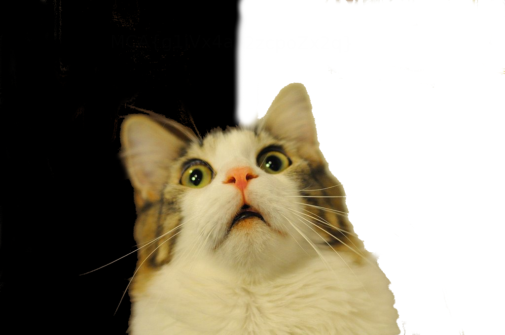
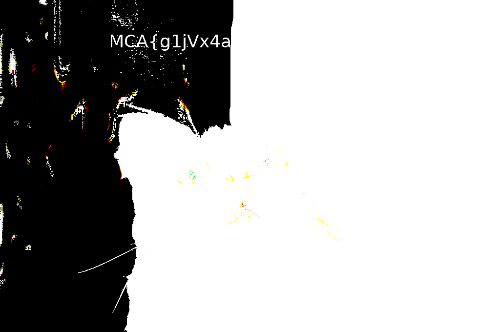

# ***Nomination***
## Grab Bag - 100 points

### Description: Surprised Pikachu is old. Let’s get this surprised cat going.

### Files included:Scaredy_cat.png


HOOOLLLYYYYY MAN so when i look at it i was looking at a cat ... legit


but when i put it in gimp i would need to change some settings in order for me to find it

I used my trusty Curves tool to do the job
so i had to curve one side to get

Then with one side done i would need the other side


We get the flag
```
MCA{g1jVx4a2zcpoZx2q}
```
but i didn't type it, i legit wrote it out on a piece of paper and then typed it in LUL
